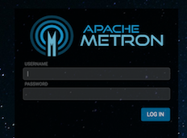
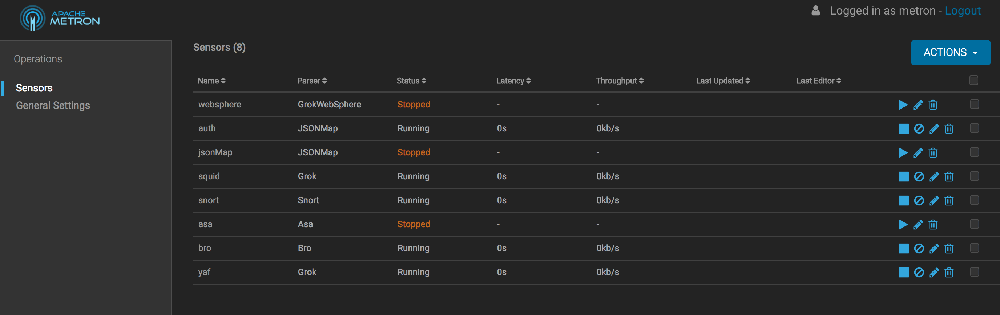
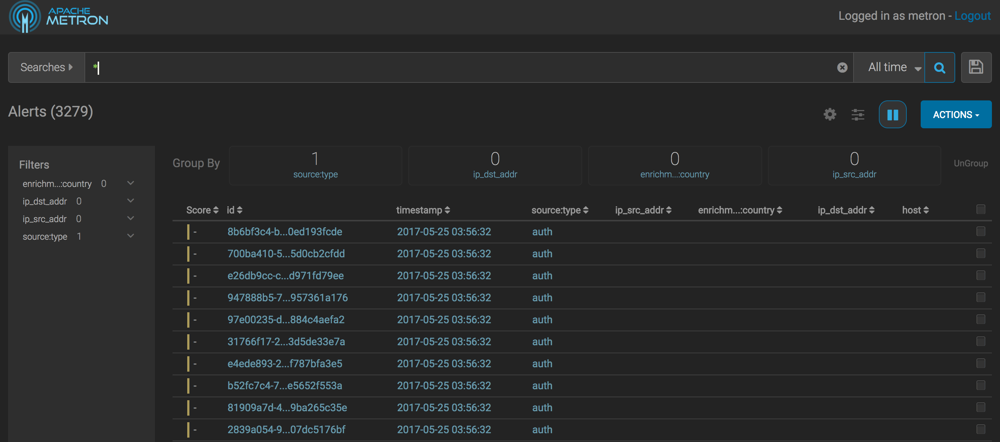
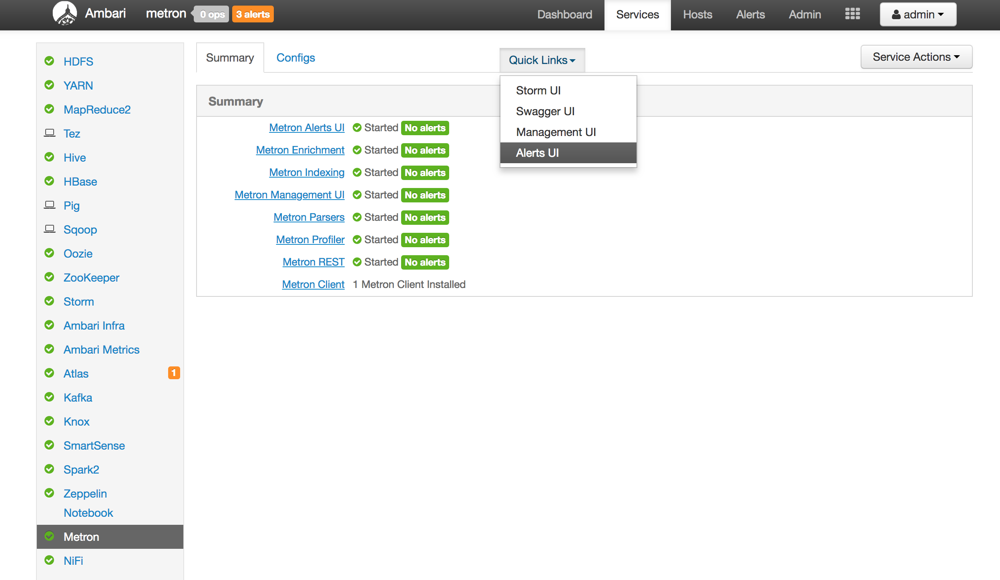

# Getting Started with Metron

## Introduction

Apache Metron is a cybersecurity pipeline platform that ingests network activity and assesses the potential threat levelof these events. Metron is more adaptable than a standard rule based system because it profiles normal user activity and responding to activity that is abnormal for a specific user type. Enrichments can be added to the events to create a more robust record and are completely configurable by the Metron user.

This tutorial will show you how to open and navigate the Metron UIs and gives you an understanding of the information each shows.

## Prerequisites

- Download the [Cloudera Cybersecurity Platform sandbox](http://needlink.com)
- Make sure you can open Ambari in the sandbox at http://mobius.local:8080 (If you can't please complete [this tutorial](../HostNameSetup/tutorial.md).)

## Outline

- [Metron Management UI](#metron-management-ui)
- [Metron Alerts UI](#metron-alerts-ui)
- [Ambari UI](#ambari-ui)
- [Summary](#summary)
- [Appendix A: Quick Reference](#appendix-a-quick-reference)

## Metron Management UI

The management UI shows the sensors configured in Metron and their operational state (running/stopped and latency). From the management UI you can create new sensors, view sensor configuration, browse raw logs sent by the sensor, and change the configuration of sensors.

Open Chrome and go to http://mobius.local:4200/ and enter metron as both the user and the password as prompted to log in.

The Metron Management UI will open and show the sensors configured and their operational state (running or stopped and latency).

## Metron Alerts UI

The Metron Alerts UI shows enriched and triaged events stored in the Metron index. From the Alerts UI you can filter and sort events and view event fields. You can also escalate, add comments to, or group events. Open your browser to http://mobius.local:4201/ and once again enter metron for both user and password.

The alerts UI wil open, listing the events reported to Metron, and allowing you to search, filter, and view details of alerts.

You can consult the [Viewing Alerts User Guide](https://docs.hortonworks.com/HDPDocuments/HCP1/HCP-1.6.1/user-guide/content/viewing_alerts.html) for more information on how to use the Alerts UI.

## Ambari UI

Open Ambari to view the status of the Metron infrastructure and start, stop, and restart services. Ambari also configures, installs, and upgrades Metron software. Open your browser to http://mobius.local:8080/ and enter admin as both the user and password to.

The Quicklinks Ambari menu item launches the UIs for a service. For example, select the Management UI and Alerts UI by selecting Services from the upper right and then Metron from the left. Pull down quick links and select Management UI or Alerts UI to launch the Metron UIs.

## Summary

You should now be able to navigate to Metron Management and Alerts UIs both directly and through the Ambari UI.

## Further Reading

If you would like to continue learning about Apache Metron you can move on to the next tutorial on [parsing squid logs](../02_ParsingSquid/tutorial.md)).

## Appendix A: Quick Reference

|Credential| Value |
|--|--|
|Metron Host Name  | Provided to you  |
|Metron Management UI|http://mobius.local:4200|
|Metron Alerts UI|http://mobius.local:4201|
|Metron Mgmt/Alerts Credentials|metron:metron|
|Ambari URL|http://mobius.local:8080|
|Ambari credentials|admin:admin|
|mysql console|mysql -u *user_name* -p|
|mysqldb root credentials|root:|
|mysqldb metron credentials|metron:Myp@ssw0rd |
|zoomdata url|http://mobius.local:6430|
|zoomdata credentials|admin:Metron1234!|
|solr admin UI|http://mobius.local:8983/solr/#/|
