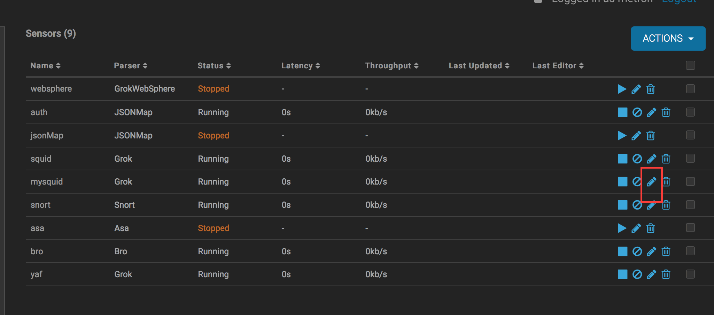
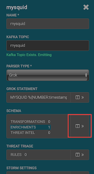
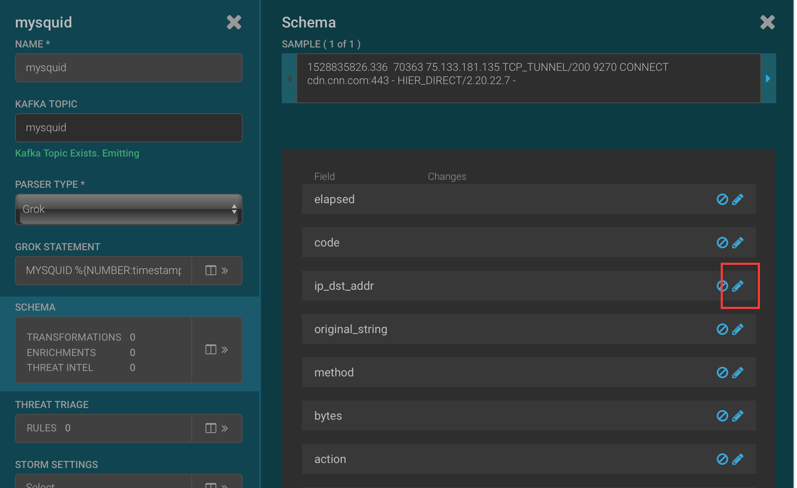
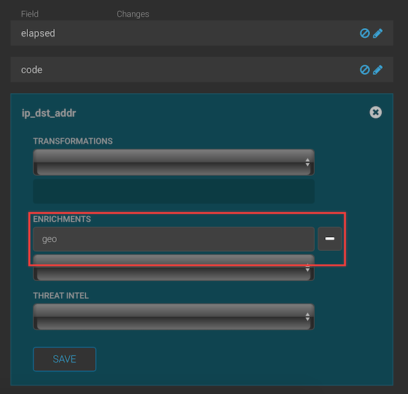
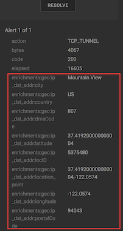

# Enriching Squid Logs

## Introduction

Adding enrichments to an event saves additional information in case the event needs investigation later by a security anaylist. It's important to include these enrichments at the time of ingestion because it can be challenging, if not impossible, to look it up later. For example, in this tutorial we will be working with geo enrichments based on IP address, and IPs can change, so looking the information up later may not provide an accurate look at what happened.

## Prerequisites

- Download the [Cloudera Cybersecurity Platform sandbox](http://needlink.com)
- Complete the previous 2 tutorials for [hcp](..).

## Outline

- [Concepts](#concepts)
- [Add a Geocode Enrichment](#add-a-geocode-enrichment)
- [View Geo Enriched Events](#view-geo-enriched-events)

## Concepts

In this tutorial we will

- Enrich an event with the geo location of ip addresses accessed through the squid proxy
- Enrich an event with field transformations

## Add a Geocode Enrichment

The geo enrichment applied to an op address instructs Metron to find the physical location of an ip address and add the location as enrichments to the event. The ip locations can be used in triaging, hunting, map visualizations, and other analytics.

Open the Metron Management UI and click on the pencil icon to the right or the mysquid sensor to edit its configuration.

Click on the >> icon to the right of the Schema section.

Click on the pencil icon to the right of the ip_dst_addr field.

Select geo from the Enrichments drop down then click save.

Scroll to the bottom of the screen and click save on the sensor and configure your proxy to send web requests to the metron proxy or use curl. Open google.com.

## View Geo Enriched Events

Open the Metron Alerts UI to see the events have been enriched with geo locations on their destination ip addresses. Click between the columns to open the event detail. The components of the geo enrichments begin with enrichments.geo.ip_dst_addr if using Solr or enrichments:geo:ip_dst_addr if using Elastic Search indices. The geocoding includes the following attributes for each known ip address: city, country, latitude, longitude, postal code, DMA code, location ID, and location point. The attributes present may differ depending on how much information is available for a specific ip address.

