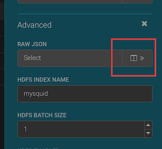
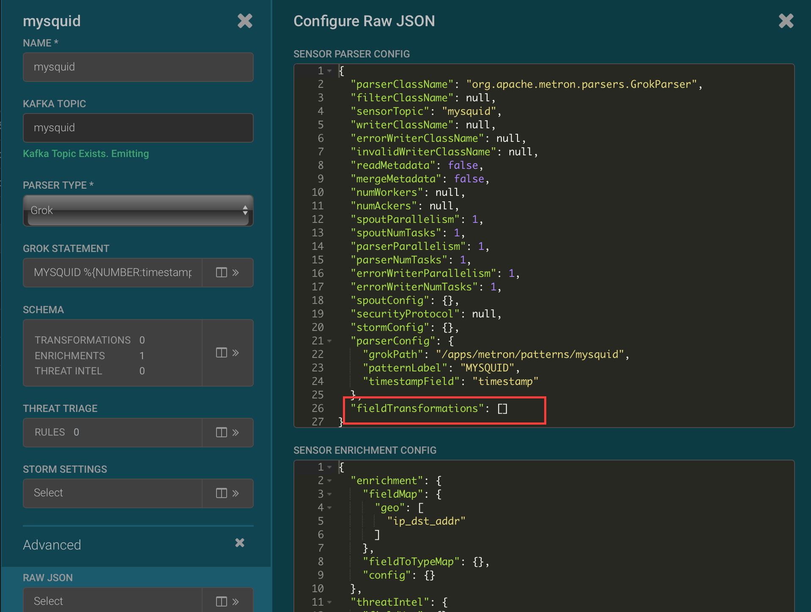
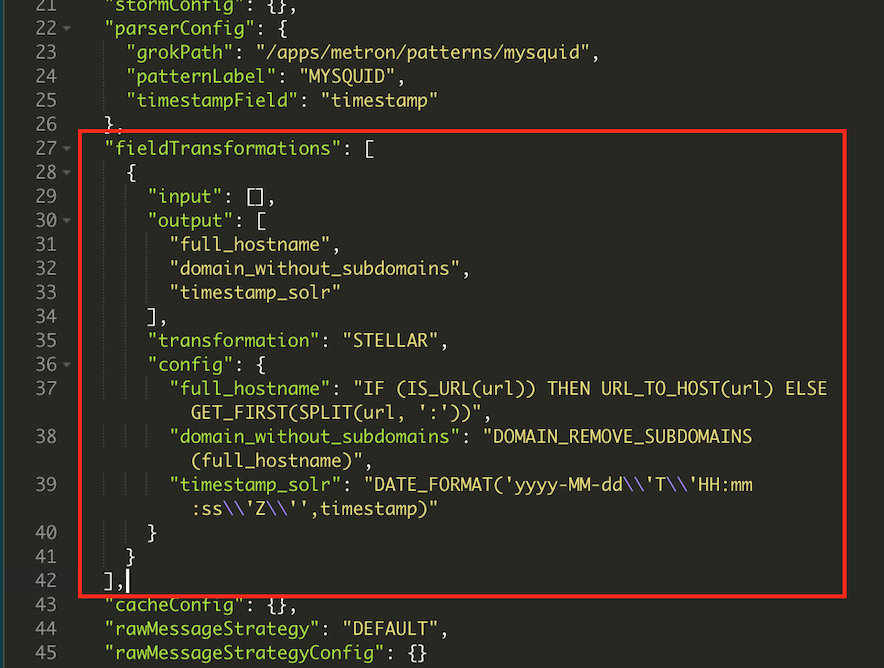
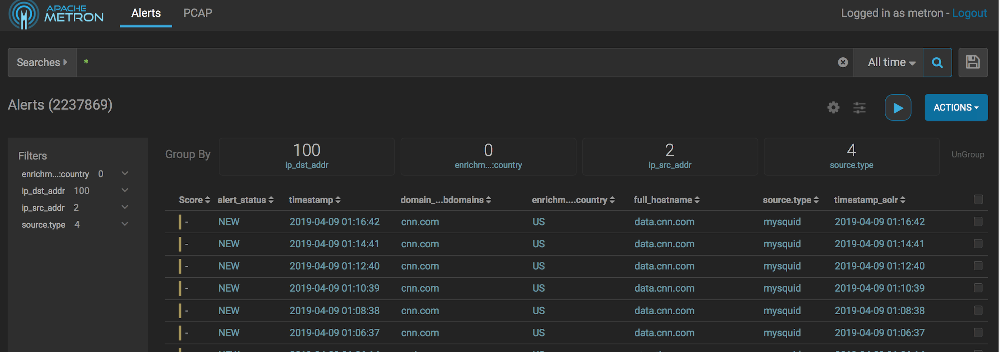

# Enriching Squid Logs

## Introduction

Adding enrichments to an event saves additional information in case the event needs investigation later by a security anaylist. It's important to include these enrichments at the time of ingestion because it can be challenging, if not impossible, to look it up later. For example, in this tutorial we will be working with geo enrichments based on IP address, and IPs can change, so looking the information up later may not provide an accurate look at what happened.

## Prerequisites

- Download the [Cloudera Cybersecurity Platform sandbox](http://needlink.com)
- Complete the previous 2 tutorials for [hcp](..).

## Outline

- [Concepts](#concepts)
- [Add a Geocode Enrichment](#add-a-geocode-enrichment)
- [View Geo Enriched Events](#view-geo-enriched-events)
- [Add Field Transformations](#add-field-transformations)
- [View Field Transformations](#view-field-transformations)
- [Summary](#summary)
- [Further Reading](#further-reading)

## Concepts

In this tutorial we will

- Enrich an event with the geo location of ip addresses accessed through the squid proxy
- Enrich an event with field transformations

## Add a Geocode Enrichment

The geo enrichment applied to an op address instructs Metron to find the physical location of an ip address and add the location as enrichments to the event. The ip locations can be used in triaging, hunting, map visualizations, and other analytics.

Open the Metron Management UI and click on the pencil icon to the right or the mysquid sensor to edit its configuration.


Click on the >> icon to the right of the Schema section.


Click on the pencil icon to the right of the ip_dst_addr field.


Select geo from the Enrichments drop down then click save.


Scroll to the bottom of the screen and click save on the sensor and configure your proxy to send web requests to the metron proxy or use curl. Open google.com.

## View Geo Enriched Events

Open the Metron Alerts UI to see the events have been enriched with geo locations on their destination ip addresses. Click between the columns to open the event detail. The components of the geo enrichments begin with enrichments.geo.ip_dst_addr if using Solr index. The geocoding includes the following attributes for each known ip address: city, country, latitude, longitude, postal code, DMA code, location ID, and location point. The attributes present may differ depending on how much information is available for a specific ip address.


## Add Field Transformations

Field transformations add new fields to the event that are derived from existing fields. Transformations prepare data for triaging, applying machine learning models or further analytics.

Open the Metron Management UI and click on the pencil icon to the right of the mysquid sensor to change the sensor configuration.

Metron configuration files are in json format. Simple transformations can be added in the Configuration UI but our example requires more complex transformations which are written in a domain specific language called [Stellar](https://docs.hortonworks.com/HDPDocuments/HCP1/HCP-1.6.1/stellar-quick-ref/content/introduction_to_stellar_language.html).

Click on the >> icon to the right of the Raw Json in the Advanced section.




On the right side in the Sensor Parser Config replace the text
```
"fieldTransformations":[],
```
with the following text:
```
"fieldTransformations": [
		{
			"input": [],
			"output": [
				"full_hostname",
				"domain_without_subdomains",
				"timestamp_solr"
			],
			"transformation": "STELLAR",
			"config": {
				"full_hostname": "IF (IS_URL(url)) THEN URL_TO_HOST(url) ELSE GET_FIRST(SPLIT(url, ':'))",
				"domain_without_subdomains": "DOMAIN_REMOVE_SUBDOMAINS(full_hostname)",
				"timestamp_solr": "DATE_FORMAT('yyyy-MM-dd\\'T\\'HH:mm:ss\\'Z\\'',timestamp)"
			}
		}
	],
```



Click save on the raw json editors and scroll down to click save on the sensor configuration.

## View Field Transformations

Generate more squid log entries. Open the Metron Alerts UI. The latest squid events will have new fields called full_hostname and domain_without_subdomains. The fields are derived from the url extracted from the original log entry. The timestamp_solr field is the event time stored in an ISO date format for building dashboards with the Banana UI. To duplicate the columns shown below click on teh gear icon and check the fields shown below. Uncheck the fields that are not shown.


## Summary

You have now enriched squid logs with extra data to help analists investigate events if it becomes necessary. The next thing Metron does is triage.

## Further Reading

- [Stellar Quick Reference](https://docs.hortonworks.com/HDPDocuments/HCP1/HCP-1.6.1/stellar-quick-ref/content/introduction_to_stellar_language.html)
