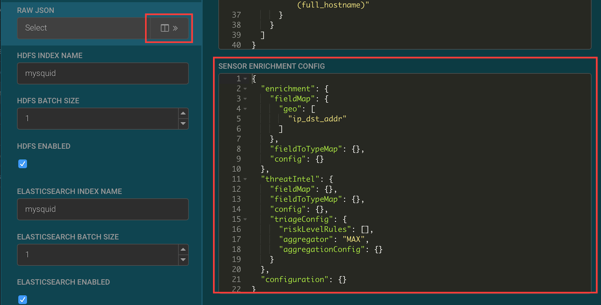
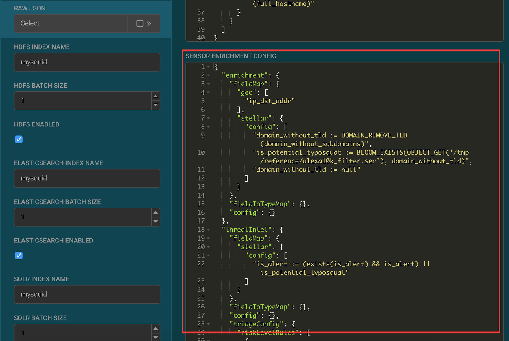
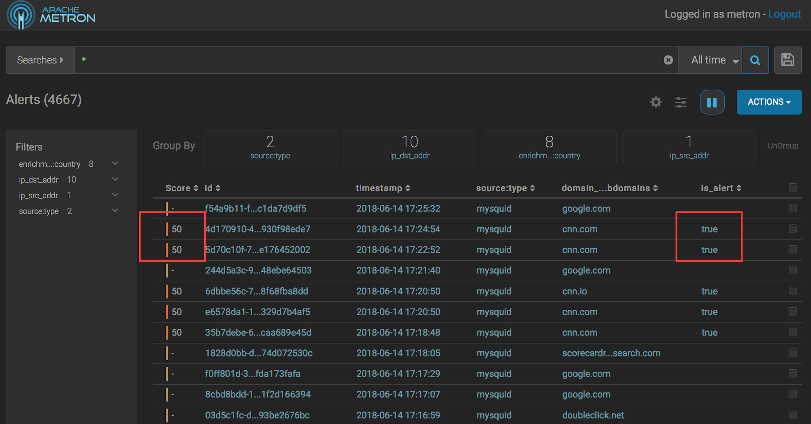
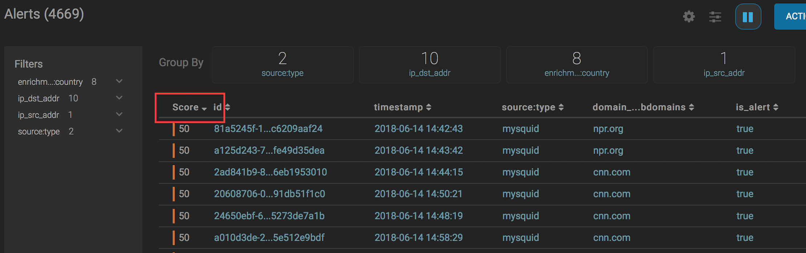
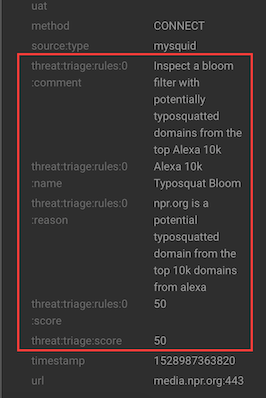
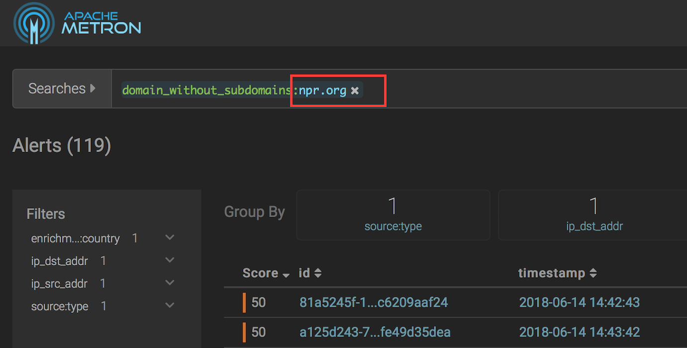
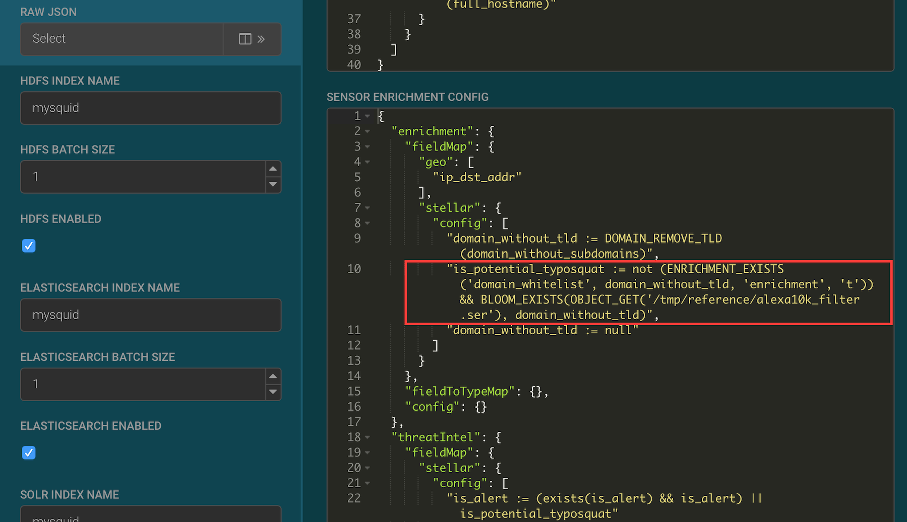

# Triaging Squid events

## Objectives

After this lab you will be able to:
1. Determine which squid events are alerts.
2. Assign a score to squid alerts using [typosquatting](https://metron.apache.org/current-book/use-cases/typosquat_detection/index.html) detection.
3. Find the highest score alerts using the Metron Alerts UI.

## Triaging Background

Security event triage rules determine which events require further follow up and which events can be archived without further investigation.   Metron will process many events every day so effective triage helps analysts focus on the most important events.  The two components of triage are:

1. Determine if the event is an alert.
2. If the event is an alert, assign a score.  If the event is not an alert, it is not scored.
For this example, we use a very simple triage rule to detect [typosquatting](https://en.wikipedia.org/wiki/Typosquatting), installing malicious web content using common domain name misspellings.

## Triaging Squid using the typosquatting algorithm

1. Open the Metron Configuration UI in the browser.

2. Click on the pencil icon next to the mysquid sensor.  The sensor configuration form opens.

3. In the Advanced section, click on the >> next to the Raw json field.



4. Replace the Json in the Sensor Enrichment Config section with the json below: 


```
{
	"enrichment": {
		"fieldMap": {
			"geo": [
				"ip_dst_addr"
			],
			"stellar": {
				"config": [
					"domain_without_tld := DOMAIN_REMOVE_TLD(domain_without_subdomains)",
					"is_potential_typosquat := BLOOM_EXISTS(OBJECT_GET('/tmp/reference/alexa10k_filter.ser'), domain_without_tld)",
					"domain_without_tld := null"
				]
			}
		},
		"fieldToTypeMap": {},
		"config": {}
	},
	"threatIntel": {
		"fieldMap": {
			"stellar": {
				"config": [
					"is_alert := (exists(is_alert) && is_alert) || is_potential_typosquat"
				]
			}
		},
		"fieldToTypeMap": {},
		"config": {},
		"triageConfig": {
			"riskLevelRules": [
				{
					"name": "Alexa 10k Typosquat Bloom",
					"comment": "Inspect a bloom filter with potentially typosquatted domains from the top Alexa 10k",
					"rule": "is_potential_typosquat != null && is_potential_typosquat",
					"score": 50,
					"reason": "FORMAT('%s is a potential typosquatted domain from the top 10k domains from alexa', domain_without_subdomains)"
				}
			],
			"aggregator": "MAX",
			"aggregationConfig": {}
		}
	},
	"configuration": {}
}
```



5. Click the Save button below the json. 

6. Click the Save button at the bottom of the mysquid sensor configuration.

7. Enter cnn.com or npr.com in the browser connected to the Metron proxy.

8. Open the Metron Alerts UI.   

9. In the Score column you will see events with non-zero scores and the is_alert field set to true.  



10. The event fields shown in the columns of the UI are configurable.  If you want to view the columns as they appear in the screen shot, click the gear icon to the left of the Actions button.  Check the Score, id, timestamp, source:type, domain_without_subdomains and is_alert fields.  Remove the check from all other columns.  Click Save.   By default, the columns after the score, id and timestamp are displayed from left to right in alphabetical order by field name.  You can change the order by clicking on the up or down button to move the columns displayed up or down.  After changing the order, click Save. 

![Configure Metron Alerts Columns] 

11. Click on the Score header to sort the events ascending by Score.   Click again to sort descending by Score.  A downward arrow appears next to the Score header when sorted descending by Score.



12.  Click between the columns of one of the Scored alerts to view the alert details.  The fields beginning with threat:triage:rules show the results of all the triage rules.   The threat:triage:score field is the aggregated score of the event.  If there were more than one triage rule, this field would contain the score combining the results from all the rules.  The is_alert field is set only if the triage rules indicate the event is an alert.   



13. To see all the alerts for a particular domain, click on the domain name.   The Alerts UI displays only the alerts with the selected domain name.


14. To remove the filter, hover over the search criteria that you want to remove and click on the x.  To view all events, click the x on the Searches field.



## Improving Scoring with a Domain Whitelist

Once a potential typosquatted domain is identified, investigated and found to be legitimate, stop future alerts by using a domain whitelist enrichment.

1. Open the Metron Configuration UI.  

2. Click on the pencil icon next to the mysquid sensor.  The sensor configuration form opens.

3. In the Advanced section, click on the >> next to the Raw json field.

4. Replace the is_potential_typosquat field with the value below:

```
"is_potential_typosquat := not (ENRICHMENT_EXISTS('domain_whitelist', domain_without_tld, 'enrichment', 't')) && BLOOM_EXISTS(OBJECT_GET('/tmp/reference/alexa10k_filter.ser'), domain_without_tld)",
```


5. Click Save under the Raw Json section.

6. Click Save on the sensor configuration.

7. Open cnn.com and npr.org in browser connected to the Metron proxy.

8. Open the Metron Alerts UI.  Click on the timestamp column header until the events are sorted descending by timestamp.  Proxy events to cnn.com and npr.org are no longer alerts. 


## Next Lab
[Profiler basics.](../05_ProfilerBasics/README.md)

## References
[Metron typosquat detection use case](https://metron.apache.org/current-book/use-cases/typosquat_detection/index.html)
