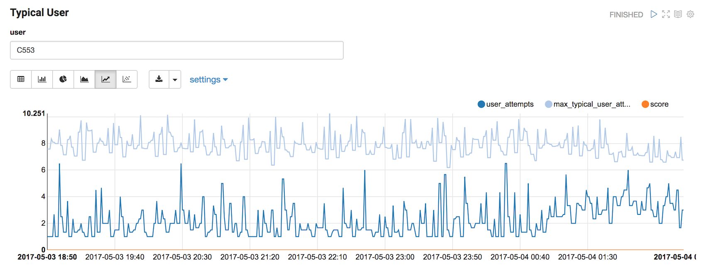

## Objectives

After this lab you will be able to:

1. Describe the components of a Metron profile.
2. Explain how to detect anomalous logins and triage events using Metron profiles.

## Background

The Metron profiler collects time series measurements using high throughput algorithms to capture the behavior of an entity.  Metron profiles are flexible and use an extension language to define the measurement to capture.   Using statistics we can compare the measurements for an entity to the measurements for its peers.  If the behavior of the entity is significantly different from its peers, we can trigger an alert.

For example, the chart below shows the user C553's profile measurements.   The light blue line is the upper bound of the typical behavior.  The dark blue line is the user's behavior.   The orange line is the score of the events.   User C553 demonstrates typical behavior because the user's behavior (dark blue) is below the maximum upper bound (light blue).  

User C1114 demonstrates intermittent anomalous behavior.  When the user's behavior (dark blue) intermittently goes above the maximum typical behavior (light blue) a scored alert is reported.  The orange spikes show the scored alerts.     

 
User U66 demonstrates consistent anomalous behavior because the user's behavior (dark blue) is consistently above the maximum typical behavior (light blue).  Almost every event is above typical behavior.   

In this lab we walk through the auth profiles, the measurements captured by those profiles, and the alerts triggered by the profile triage rules. 

