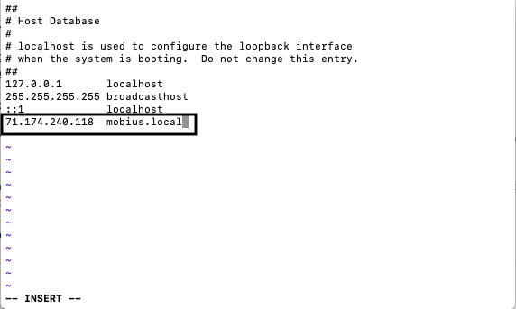

# Host Name Setup

## Introduction

In most cases this setup will be completed for you, but in case it hasn't or doesn't work we are providing the information so you can set it up. Setting up a host name allows us to use easier to remember and type phrases, such as mobius.local (in HCP tutorials), instead of using your IP address to navigate your browser.
In this tutorial we will provide instructions for this set up both in Linux, Unix, and OSX, as well as in Windows.

## Prerequisites

There are no prerequisites for this tutorial.

## Outline

- [Linux/Unix/OSX](#linux-unix-osx)
- [Windows](#windows)

## Linux/Unix/OSX

Open terminal and enter `sudo vi /etc/hosts` to open the hosts file. Hit `i` to edit the file and add a line `host_ip mobius.local` where *host_ip* is your IP address.

Once that is done hit escape to get back to the command line and type `:wq` and enter to save and exit the file.

## Windows
